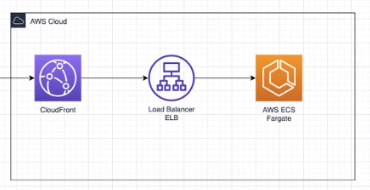
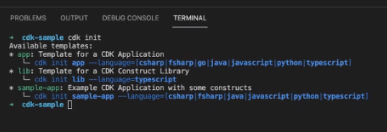
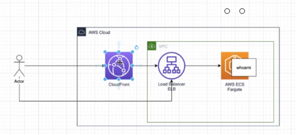

# Deploy Kofax RPA on AWS Cloud Development Kit

Cloud Development Kit (CDK) uses python, typescript etc to make it easy to programmatically generate a cloudformation template json file.  
advantages
* write once, automate 100%
* easy to deploy everything and destroy everything
* can do ANYTHING on AWS, not just containers.
* easy to configure. EG enabling SSH access to containers is a single statement, whereas other methods require dozens of steps to configure all the security.

typescript samples on GitHub https://github.com/aws-samples/aws-cdk-examples  
[Typescript examples](https://github.com/aws-samples/aws-cdk-examples/tree/master/typescript)  
[fargate-application-load-balanced-service](https://github.com/aws-samples/aws-cdk-examples/tree/master/typescript/ecs/fargate-application-load-balanced-service/)

Cloud Formation Template Designer in drawio.corp.amazon.com  

*this doesn't have a great reputation and is not considered to have a lot of value*

* [install typescript](https://github.com/aws-samples/aws-cdk-examples/tree/master/typescript#typescript-examples)  
* in VS Code  


[Getting started with CDK](https://docs.aws.amazon.com/cdk/latest/guide/getting_started.html) 


# Install CDK
* install [Node.js installer](https://nodejs.org/en/download/)
* at commandline run
```
C:\Windows\System32\cmd.exe /k "C:\Program Files\nodejs\nodevars.bat"
npm install -g typescript
npm install -g aws-cdk
cd %USERPROFILE%\AppData\Roaming\npm\node_modules
cd aws-cdk
```
[Create a new CDK project](https://docs.aws.amazon.com/cdk/latest/guide/work-with-cdk-typescript.html)
```
mkdir cdk-sample
cd cdk-sample
rem view available templates
cdk init
code .
cdk init sample-app --language=typescript
```
## Edit your CDK project
* Delete the definition of the variable **queue** (lines 10-16) from **lib\cdk-sample-stack.ts**  
* delete the first 3 imports.
* Open https://github.com/aws-samples/aws-cdk-examples/blob/master/typescript/ecs/fargate-application-load-balanced-service/index.ts
* copy the first 3 dependencies
* copy the **vpc** (Virtual Private Cloud), **cluster** and **ecs_patterns** definitions
```typescript
import ec2 = require('@aws-cdk/aws-ec2');
import ecs = require('@aws-cdk/aws-ecs');
import ecs_patterns = require('@aws-cdk/aws-ecs-patterns');
import * as cdk from '@aws-cdk/core';

export class CdkSampleStack extends cdk.Stack {
  constructor(scope: cdk.App, id: string, props?: cdk.StackProps) {
    super(scope, id, props);
    
    // Create VPC and Fargate Cluster
    // NOTE: Limit AZs to avoid reaching resource quotas
    const vpc = new ec2.Vpc(this, 'MyVpc', { maxAzs: 2 });  //Az use a max of 2 Availability Zones in the region https://aws.amazon.com/about-aws/global-infrastructure/regions_az/
    const cluster = new ecs.Cluster(this, 'Cluster', { vpc });

    // Instantiate Fargate Service with just cluster and image
    new ecs_patterns.ApplicationLoadBalancedFargateService(this, "FargateService", {
      cluster,
      taskImageOptions: {
        image: ecs.ContainerImage.fromRegistry("amazon/amazon-ecs-sample"),  // a Docker container from Docker Hub
      },
    });
    
  }
}
```
* Change the 3 dependencies to **package.json** keeping the same version number as **core**. (12:19)
```json
  "dependencies": {
    "@aws-cdk/core": "1.134.0",
    "@aws-cdk/aws-ec2": "1.134.0",
    "@aws-cdk/aws-ecs": "1.134.0",
    "@aws-cdk/aws-ecs-patterns": "1.134.0"
  }
```
* install your app 
```cmd
rem install dependencies
npm install
cdk deploy
REM view it at https://eu-central-1.console.aws.amazon.com/cloudformation/home
cdk destroy
```

##  Cloudfront for HTTPS

Cloudfront will give us an AWS IP address with HTTPS and valid public certificate.  

Add to .ts file
```
import * as cloudfront from '@aws-cdk/aws-cloudfront';
import * as origins from '@aws-cdk/aws-cloudfront-origins'
```
add to package.json
```
    "@aws-cdk/aws-cloudfront": "1.134.0",
    "@aws-cdk/aws-cloudfront-origins": "1.134.0"
```
you now have this
```
import ec2 = require('@aws-cdk/aws-ec2');
import ecs = require('@aws-cdk/aws-ecs');
import ecs_patterns = require('@aws-cdk/aws-ecs-patterns');
import * as cloudfront from '@aws-cdk/aws-cloudfront';
import * as origins from '@aws-cdk/aws-cloudfront-origins';
import { OriginProtocolPolicy } from '@aws-cdk/aws-cloudfront'

import * as cdk from '@aws-cdk/core';

export class CdkSampleStack extends cdk.Stack {
  public readonly postsContentDistrubtion: cloudfront.Distribution;
  constructor(scope: cdk.App, id: string, props?: cdk.StackProps) {
    super(scope, id, props);
    
    // Create VPC and Fargate Cluster
    // NOTE: Limit AZs to avoid reaching resource quotas
    const vpc = new ec2.Vpc(this, 'MyVpc', { maxAzs: 2 });
    const cluster = new ecs.Cluster(this, 'Cluster', { vpc });

    // Instantiate Fargate Service with just cluster and image

    // we create an Application Load Balancer
    var lb = new ecs_patterns.ApplicationLoadBalancedFargateService(this, "FargateService", {
      cluster,
      taskImageOptions: {
        // https://docs.aws.amazon.com/cdk/api/latest/docs/aws-ecs-patterns-readme.html
        image: ecs.ContainerImage.fromRegistry("amazon/amazon-ecs-sample"),
        //add 3  containers (MC, roboserver, database) to 1 task as in 
        // https://github.com/aws-samples/aws-cdk-examples/blob/08600cd2c0080994c9d4d478b259a8213a786272/typescript/ecs/ecs-service-with-task-placement/index.ts#L21
      },
    });

    //Create a new cloudfront distribution, using a a source the lb
    this.postsContentDistrubtion = new cloudfront.Distribution(
      this,
      "PostsContentDistribution",
      {
        defaultBehavior: {
          //disables HTTPS because we don't have a publicly trusted certificate
          origin: new origins.LoadBalancerV2Origin(lb.loadBalancer,{protocolPolicy: OriginProtocolPolicy.HTTP_ONLY}),
        },
      }
    );
    
  }
}
````
* run PowerShell terminal
* type **npm install** into install missing dependencies in the json.
* type **cdk synth** to create everything in the **cdk-out** folder.
* type **cdk deploy --require-approval never** to deploy to AWS. (it uses your Amazon credentials from the aws command-line tool)   
*If you don't add **--require-approval never** then you will get a Y/N prompt to continue.*
* the last line of output gives the entry URL for Fargate
```
CdkSampleStack.FargateServiceServiceURL47701F45 = http://CdkSa-Farga-PRGKVGUKFGO8-1132970192.eu-central-1.elb.amazonaws.com
```
* **cdk destroy** . *Note: load balancer costs 1.35$/day*


* view [cloud front distributions](https://console.aws.amazon.com/cloudfront/v3/home#/distributions)  
this gives you a domain name with https and a valid certificate.  

The Actor connects via https to Cloudfront which connects over the public internet via http to Load Balancer.
* go to [cloud formation stack](https://eu-central-1.console.aws.amazon.com/cloudformation/home?region=eu-central-1) and click on **Outputs** to see where the public load blanacer is (security is only through obscurity) (perhaps there is a way to make a certificate between cloudfront and load balancer...)  

## [Cloud Formation Designer](https://eu-central-1.console.aws.amazon.com/cloudformation/designer/home?region=eu-central-1)  
Open a template from /.../cdk-out/{filename}Stack.template.json

## Support case 9424605201
https://console.aws.amazon.com/support/home?#/case/?displayId=9424605201&language=en
* Add 3 containers to a [FargateTaskDefinition](https://docs.aws.amazon.com/cdk/api/v1/docs/@aws-cdk_aws-ecs.FargateTaskDefinition.html) instead of **Ec2TaskDefinition**.
* [ECS Port Mapping](https://docs.aws.amazon.com/AmazonECS/latest/APIReference/API_PortMapping.html)
* [HTTPS for Load Balancer in FarGate](https://docs.aws.amazon.com/cdk/api/v1/docs/@aws-cdk_aws-ecs-patterns.ApplicationLoadBalancedFargateService.html#certificate)
* **ApplicationLoadBalancedFargateService** is adequate for 3 containers with 1 port exposed.

## Done
* add 3 docker images. https://github.com/aws-samples/aws-cdk-examples/blob/08600cd2c0080994c9d4d478b259a8213a786272/typescript/ecs/ecs-service-with-task-placement/index.ts#L21
* make a different task for each container
* add docker environment variables  
* postgres does not exit
* roboserver has no logger.
* I can SSH to all 3 servers with  command line interface
``aws ecs execute-command --cluster %cluster% --task %task% --container rs/mc/postgres --interactive --command "/bin/sh"``

## To Do
* MC cannot see postgres (add containerName to container)
  * the container name is not important. the service name is passed to the DNS.
  * I need to create a DNS that is seem by all of the containers.
  * the 3 services need to be added to the DNS
  * it seems that the DNS name needs to be adding to the machine names in all of the URLS. I doubt this but lets see.
    * [Service Discovery](https://ecsworkshop.com/introduction/ecs_basics/servicediscovery/)
    * [Service Creation Tutorial](https://docs.aws.amazon.com/AmazonECS/latest/developerguide/create-service-discovery.html)
    * [Service Discovery in Fargate in CDK](https://stackoverflow.com/questions/66799660/using-cdk-to-define-ecs-fargate-cluster-with-service-discovery-without-load-bal)
    * [Service Discovery Documentation](https://docs.aws.amazon.com/AmazonECS/latest/developerguide/service-discovery.html)

* MC should wait for postgres container to load or it should retry (better for speed). Both have essential=true.
* parametrize passwords.  and it seems to make them checkboxes and dropdowns for marketplace I need to manually edit the json in cdk-out.*
* get into store
* scale roboservers [https://github.com/aws-samples/aws-cdk-examples/tree/master/typescript/ecs/fargate-service-with-auto-scaling]
  * I can have multiple fargate services - one for each component that autoscales - there is another way to do it as well according to Petr Tomanik..
* optional images (KT, synchronizer, analytics)
# Version 2.0 features
* persistent database
* persistent storage
