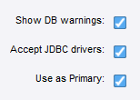

# POC - done
* [x] Upload Management Console and Roboserver to Amazon's container Repository
* [x] Postgres Database in an ephemeral container, MC & Roboserver
* [x] Default to **Non Production** Cluster
* [x] Deploy database + MC + Roboserver to Cloud.

# Phase 1 - Internal
* [x] Add to Amazon Repository
* [x] Roboserver logging to Postgres database. (by default it logs to "Development Database" which is not even running)
* [x] Create groups **Developers**, **Roboservers**, **Kapplet Users**, **Project Admininstrators**, **Kapplet Administrators**
* [x] run configure script in second thread from managementconsole.sh
* [x] restore MC from backup for users, groups, project roles, cluster database
* [x] Make roboserver wait until it can log in before starting the roboserver. 
* [x] Get **NewsMagazine.robot** log to MC log database.
* [x] Get **NewsMagazine.robot** to  write data to MC's postgres database.
* [x] make **NewsMagazine.robot** create object table in Postgres.
* [x] make sure roboserver waits until MC restore is finished before connecting to cluster. beware roboserver fails to connect to MC after 3rd attempt, so use curl to see that MC is ready.
* [x] Changes to Backup
  * [x] Non-Production cluster uses **scheduler** database for data.
  * [x] MC/Settings/DesignStudio/DatabasesToSendToDesignStudio=false
  * [x] no robot dev nor roboserver user (both added later)
  * [x] Load **NewsMagazine.robot**, which writes to MC data database and usable in Kapplets
  * [x] Build Backup.zip from source robot files. *This makes us future safe when editing the backup package. We can now add robots and configs in a trackable way*
* [x] create personal user and add to the Kapplet Users, developers and Admin groups. 
* [x] Get MC+roboserverwait+restore running on AWS
* [ ] Create Cloud Formation Template  (CFT) for Kofax RPA using typescript
  * [ ] Add HTTPS
* [ ] View CFT in CF Designer online
* [ ] Add roboserver scaling to CFT
* [ ] Add to Amazon Market Place
* [ ] Change Admin password 
* [ ] ensure roboserver runs with new password
* [ ] Deploy with Wizard from Amazon Marketplace.  
* [ ] Upload postgres driver to MC (it goes to Postgres table mc_jar_file) http://localhost:8080/api/mc/setting/Database/Drivers/add  Do i really need this?  
Accept-Encoding: gzip, deflate 
```
Content-Disposition: form-data; name="file"; filename="postgresql-42.2.19.jar"
Content-Type: application/octet-stream
```
* [ ] Make sure that Design Studio can download Postgres JDBC driver from MC.  

## BLOCKING
* Roboserver won't connect if failed to login twice. with Benjamin  
*workaround: wait for MC to restore backup before launching roboserver, by curling if roboserver user can log in*

# Phase 2 - Sharable with Community
* [ ] Check the [Amazon Aurora Postgres](https://docs.aws.amazon.com/AmazonRDS/latest/AuroraUserGuide/Aurora.AuroraPostgreSQL.html) is actually compatible with Kofax RPA. (i created a Free Tier, lowest level 20GB which is 0.019c/hour in Frankfurt. Serverless seems to be in beta...)
* [ ] Add logs and data databases into postgres. [Postgres envars](https://www.postgresql.org/docs/current/libpq-envars.html) [Adding users/databases](https://hub.docker.com/_/postgres)
* optimize CPU and RAM for MC & Roboserver
* Kapplets
* import 
  * sample kapplets
  * user groups
  * roboserver user & password
* scalable roboservers
* optional log http traffic.
* optional log user actions.
* enable/disable documentation requests

# Phase 3
* Git Synchronizer
* Amazon Aurora database support for persistence.
* Support external storage for database .
* RFS
* Kofax Transformation (not compatible with FarSight. Need ECS)
* Make rfs, kapplets, synchronizer optional

# Phase 4
* Kubernetes
* Docker secrets
* AD or LDAP for users and groups. Maybe with an Open LDAP container.
* VPN/tunnel for backoffice DTS.

# Notes
* PostGres is in 11.2 because we cannot redistribute the MySQL JDBC driver. and Postgres more popular on cloud maybe.
* where are all the roboserver environment variables? docker/Readme.md

# Ask AWS
* put on amazon store - another specialist will show me how to put cloud formation template onto Amazon Store.
* adding database
* https xyz. - CloudFront. workaround. Load Balancer certificate for Cloud Front. 
* scaling roboserver.


* how to shutdown modules for enduser - database, rfs, kapplets, synchronizer